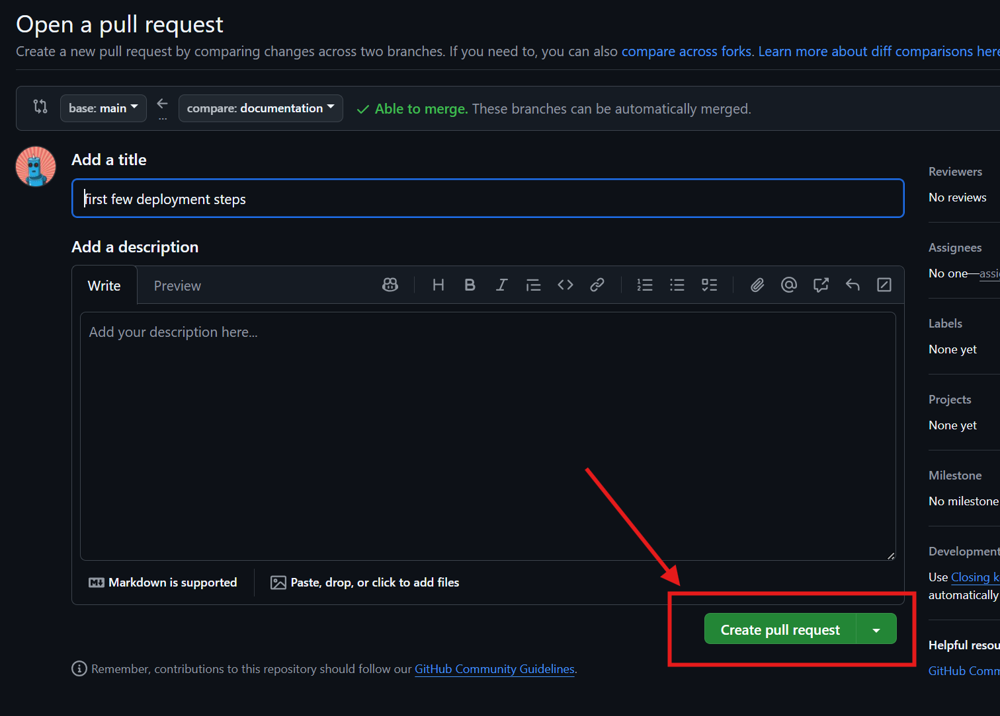
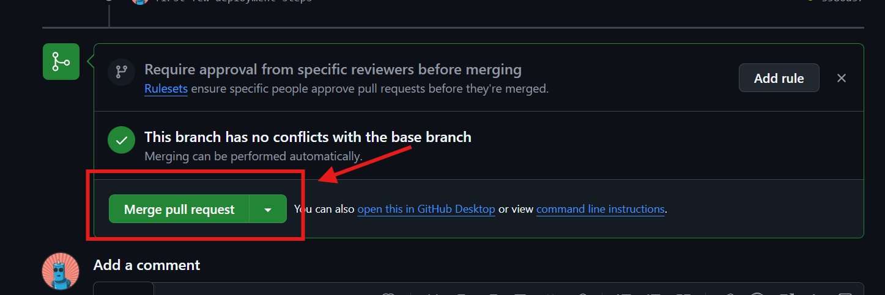
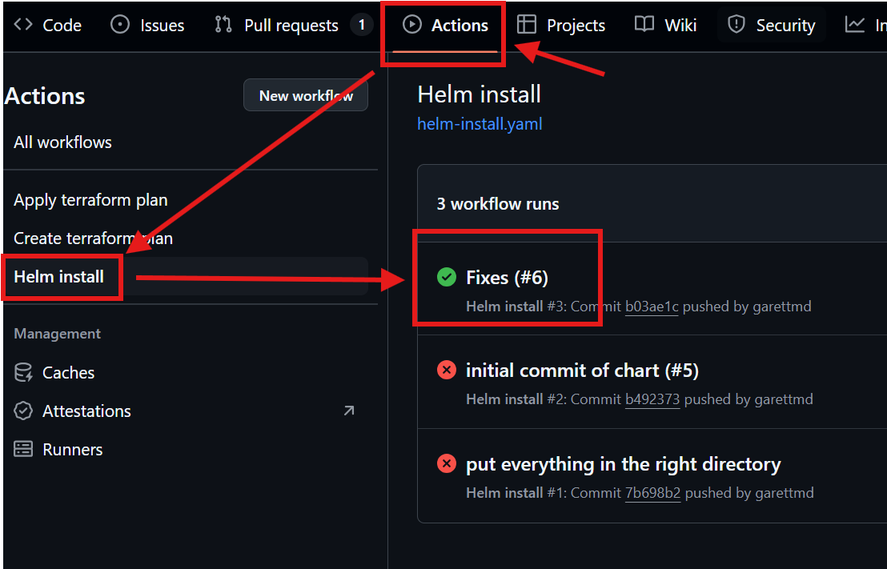

# comet

## Getting Started

Deployment of _comet_ is handled by Github Actions. The steps to deploy the application are:

1. Clone the repository

```shell
git clone https://github.com/garettmd/comet.git
```

2. Checkout a feature branch to include updates on

```shell
git checkout -b my-feature
```

3. Make your changes and apply them

```shell
git add .
git commit -m "My commit message"
```

4. Push the branch to Github and start a Pull Request (PR)

```shell
git push -u origin my-feature
```

Example output:

```shell
Enumerating objects: 5, done.
Counting objects: 100% (5/5), done.
Delta compression using up to 8 threads
Compressing objects: 100% (3/3), done.
Writing objects: 100% (3/3), 684 bytes | 684.00 KiB/s, done.
Total 3 (delta 0), reused 0 (delta 0), pack-reused 0
remote: 
remote: Create a pull request for 'documentation' on GitHub by visiting:
remote:      https://github.com/garettmd/comet/pull/new/documentation
remote:
```

Open the Pull Request URL provided by the git command output into your browser, and create the PR there.



5. Wait for the checks to finish, then select the "Merge Pull Request" button to deploy the update.



6. Check on the progress of the deployment by viewing the latest Actions run for the Helm Install workflow

